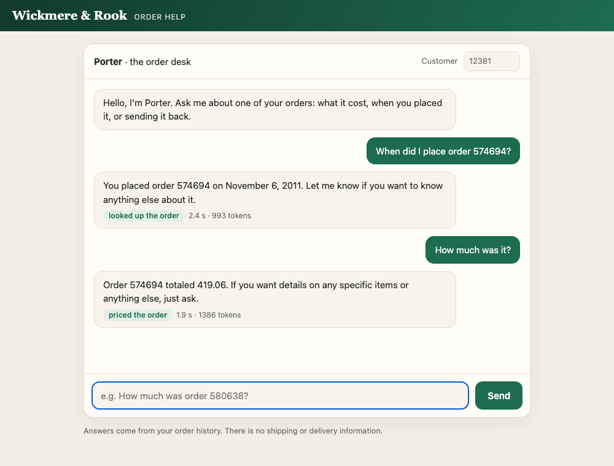
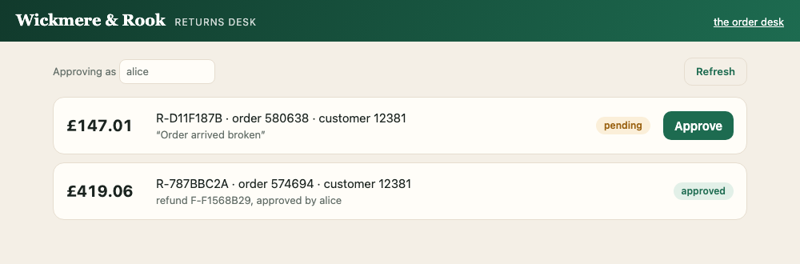
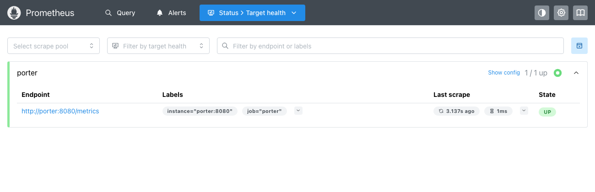
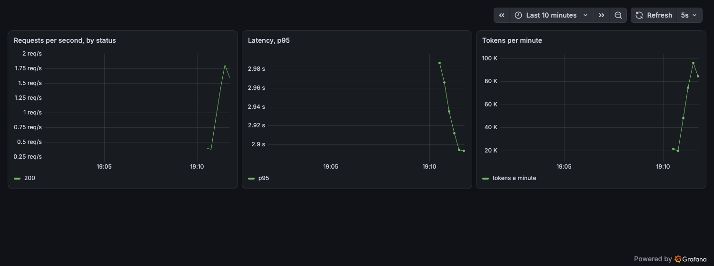

# Running an Agent

**Porter, the order desk of Wickmere & Rook, packaged into a container with Postgres beside it, watched with Prometheus and Grafana on this laptop, then deployed, with all of them, to one AWS server.**

## What we're trying to do

- **The agent:** Porter answers a customer's questions about their own orders (what an order cost, when it was placed) by looking them up in the shop's database, and opens a return request when a customer asks to send something back. A member of staff then approves the request, and only that writes a refund.
- **It remembers the conversation:** each one is kept in Postgres under a `thread_id`, so a follow-up question can say "it".
- **Where it starts:** the agent answers inside a notebook, on one laptop.
- **Where it ends:** the agent in a container, with Postgres beside it, Prometheus collecting its numbers every 5 seconds and Grafana drawing them, first on this laptop and then on an AWS server anyone can open at `http://<its address>:8080`.
- **What it offers:**

| route | what it does |
|---|---|
| `GET /` | the chat page, for customers |
| `POST /v1/chat` | one question in, with the conversation's `thread_id`; the reply, the tools used and the tokens out |
| `GET /staff` | the returns desk, for staff |
| `GET /v1/returns` | every return request, and its refund once paid |
| `POST /v1/returns/{id}/approve?staff=<name>` | a member of staff pays one request, once |
| `GET /healthz` | says it's up and can read the orders |
| `GET /metrics` | the service's numbers, for Prometheus |

## How we're doing it

**Each Part answers one question nobody can answer yet, with the smallest piece of code or configuration that does it. Everything runs on this laptop first; the last Part takes it to a server.**

| Part | what nobody can answer yet | what answers it |
|---|---|---|
| P0 · Setup | does the agent answer? | `answer()`, called in the notebook |
| P1 · The container | does it run anywhere but this laptop's Python? | a two-stage image built from the `Dockerfile`; `compose.app.yaml` hands the container its key, its data and a volume for the ledger, and runs Postgres beside it for the conversations; a return request approved by staff, once |
| P2 · Prometheus | how many requests, how many failed, how slow? | three metrics in `porter/api.py`, collected every 5 seconds by a Prometheus container: `compose.prometheus.yaml` |
| P3 · Grafana | can you see all that at a glance? | a dashboard of three panels, read from `grafana/`: `compose.yaml` |
| P4 · Off the laptop | can anybody else reach it, and can you still watch it? | `deploy/create.sh` and `deploy/push.sh`: one EC2 instance running the same four containers, port 8080 open; Prometheus and Grafana through an ssh tunnel |

- **P0 to P3 run on this laptop, one Compose file each, each one service more:** `compose.app.yaml` (Porter and Postgres), `compose.prometheus.yaml` (those and Prometheus), `compose.yaml` (all four). P4 runs `compose.yaml` on an AWS server.

## How to go through this folder

| Parts | what has to be running |
|---|---|
| P0 | an OpenAI API key in `.env` |
| P1 · P2 · P3 | that, and Docker, with ports 8080, 9090 and 3000 free |
| P4 | that, AWS credentials that work, and `./deploy/tunnel.sh` in a terminal of its own |

1. **Once:** `cp .env.example .env` and put your OpenAI API key on the `OPENAI_API_KEY=` line. Start Docker Desktop. For P4, run `aws configure`; `aws sts get-caller-identity` then prints your account.
2. **P0 to P3:** open `v5_workshop_2_running_an_agent.ipynb` and run it from the top. A `!` line is a command you could type in a terminal, in this folder.
   - P1 builds the image (`docker build -t porter:1.0 .`) and starts it with Postgres beside it (`docker compose -f compose.app.yaml up -d`): the chat page is at <http://localhost:8080>, the returns desk at <http://localhost:8080/staff>.
   - P2 adds Prometheus (`docker compose -f compose.prometheus.yaml up -d`): <http://localhost:9090>. Porter and Postgres keep running as they were.
   - P3 adds Grafana (`docker compose up -d`, which reads `compose.yaml`): <http://localhost:3000>.
   - `docker compose ps`, `logs`, `stop` and `down` need no `-f` at any step: they read `compose.yaml`, which names all four services.
3. **P4:** the notebook runs `./deploy/create.sh` (the instance) and `./deploy/push.sh` (copy the folder up, build the image there, start all four). `push.sh` prints the server's address. **`deploy/README.md` has the same steps as plain `ssh` and `scp` commands,** to type yourself.
4. **P4, watching the server:** the notebook stops the laptop's Prometheus and Grafana. Then, in a terminal, in this folder, start `./deploy/tunnel.sh` and leave it running: <http://localhost:9090> and <http://localhost:3000> are now the server's.
5. **When you're done:** `./deploy/destroy.sh` (everything `create.sh` made; the cost stops), `docker compose down`, and Ctrl+C on the tunnel.

**The files, by the step that needs them:**

| step | files |
|---|---|
| 1 · once | `.env.example` → `.env`: your key. Never committed, never copied into the image |
| 2 · P0 | `v5_workshop_2_running_an_agent.ipynb`; `porter/`, the service; `online_retail.db`, the orders |
| 2 · P1 | `Dockerfile`, `requirements.txt`, `.dockerignore`: the image. `compose.app.yaml`: how it runs, with Postgres beside it |
| 2 · P2 | `compose.prometheus.yaml`; `prometheus.yml` |
| 2 · P3 | `compose.yaml`; `grafana/`: the data source and the dashboard |
| 3 · P4 | `deploy/create.sh`, `deploy/user_data.sh` (installs Docker on the instance), `deploy/push.sh`; or `deploy/README.md`, the same by hand |
| 4 · P4 | `deploy/tunnel.sh` |
| 5 · done | `deploy/destroy.sh` |
| not needed to go through it | `v5_workshop_2_build_nb.py`, which builds the notebook · `docs/`, this README's pictures · `pending.md`, a to-do list for the next run |

## Using the app

### The chat page: <http://localhost:8080> (P1), `http://<the server's address>:8080` (P4)

- Pick a suggestion or type a question. Under each reply: the tools Porter used, how long it took and how many tokens it spent.
- **It's one conversation until the page is reloaded:** ask "When did I place order 574694?", then "How much was it?". The page sends back the `thread_id` of its first reply with every later question.
- **Customer** says whose orders the questions are about. 12381 has six orders, among them 580638, 574694 and 570681; an order that isn't theirs gets "no order … on this account".
- Ask to send an order back ("Order 574694 arrived broken. Please open a return for it.") and Porter opens a return request.

### The returns desk: <http://localhost:8080/staff>

- Every return request, newest first. **Approve** pays a pending one: a refund is written, and the request shows who approved it.
- **Approving as** is the member of staff's name. There's no sign-in: whoever opens the page can approve.

### Prometheus: <http://localhost:9090> (P2; through the tunnel in P4)

- **Status → Target health** (`/targets`): one target, `porter`, with the state UP.
- **Query** (`/query`): paste a PromQL expression, press Execute, and open the Graph tab. `sum(rate(porter_requests_total{route="/v1/chat"}[1m]))` is requests a second; the notebook's P2 has five to try.

### Grafana: <http://localhost:3000> (P3; through the tunnel in P4)

- The **Porter** dashboard is the home page, with no login, refreshing every 5 seconds: requests per second by status code, p95 latency, and tokens per minute.
- The lines move once traffic arrives: the notebook's P3 sends a minute of it.

## The service

| file | what it does |
|---|---|
| `porter/settings.py` | every setting, read from the environment once, at start-up |
| `porter/tools.py` | `build_tools()`: `look_up_order` and `price_order` read the orders, `start_return` writes a request to the ledger. All three are bound to one customer |
| `porter/ledger.py` | the ledger, a small SQLite file apart from the shop's orders: `request_return()`, `list_returns()`, and `approve()`, which writes one refund per request, however often it's called |
| `porter/agent.py` | `build_agent()`: the model, the tools, the rules, at most 6 model calls and 8 tool calls, and two retries of a failed model call. `open_checkpointer()`: where conversations are kept, Postgres when `PORTER_POSTGRES_DSN` is set, else the process's memory. `answer()` asks one question, in the conversation its `thread_id` names |
| `porter/api.py` | the routes, and the three metrics: `porter_requests_total`, `porter_request_seconds` and `porter_tokens_total` |
| `porter/web/` | `index.html`, the chat page, and `staff.html`, the returns desk |

**Configuration,** in `.env` or the environment:

| variable | default | what it sets |
|---|---|---|
| `OPENAI_API_KEY` | none | the key: the only one you must set |
| `PORTER_MODEL` | `gpt-4.1-mini` | another model |
| `PORTER_PROVIDER` | `openai` | `ollama` runs `gpt-oss:20b` in Ollama on this machine instead; `.env.example` shows what a container needs as well |
| `PORTER_DB_PATH` | `online_retail.db` in this folder | where the orders are. The image sets `/data/online_retail.db`, where Compose mounts them |
| `PORTER_LEDGER_PATH` | `porter_ledger.sqlite` in this folder | where return requests and refunds are written. The image sets `/state/porter_ledger.sqlite`, on the `porter-state` volume |
| `PORTER_POSTGRES_DSN` | empty: conversations in the process's memory, as in the notebook's P0 | where conversations are kept. The Compose files set it to the `postgres` service, whose files are on the `porter-pgdata` volume |
| `PORTER_MAX_MODEL_CALLS` · `PORTER_MAX_TOOL_CALLS` | 6 · 8 | the ceilings on one run |

## What it leaves out, on purpose

It's a demonstration, so it takes shortcuts a real deployment wouldn't:

- **Plain `http`.** Anyone on the way can read the traffic. A real site sits behind `https`.
- **No sign-in.** Whoever calls names the customer, or the member of staff approving a refund, so anybody can ask about anybody's orders, approve any refund, and spend the key's money.
- **`/metrics` is public** on port 8080, like the rest of the service.
- **Postgres's password is `porter`, written in the Compose files.** No port of it is published, so only the containers beside it can reach it.
- **One server.** If it goes, the service goes, and Prometheus with it.

## If something goes wrong

- **"port is already allocated" when a container starts:** another container already holds 8080, 9090 or 3000. `docker ps` shows which; stop it, then run the cell again. (Any Compose project with `restart:` comes back on its own when Docker Desktop starts.)
- **`curl localhost:8080/healthz` prints nothing:** the container is still starting. Give it a few seconds.
- **`create.sh` says the credentials aren't working:** `aws configure`, then `aws sts get-caller-identity`.
- **`push.sh` or the tunnel hangs:** the security group lets ssh in only from the address this laptop had when `create.sh` ran. On a new network, run `./deploy/create.sh` again: it adds the new address.
- **The instance was stopped and started:** its public address changed. Run `./deploy/create.sh` again to refresh `deploy/.state`.
- **The tunnel says "Address already in use":** the laptop's Prometheus or Grafana is still running. `docker compose stop prometheus grafana`, then start the tunnel again.

## Data

`online_retail.db` is built from [UCI *Online Retail*](https://archive.ics.uci.edu/dataset/352/online+retail) (Chen, 2012), CC BY 4.0: 541,909 order lines from a UK gift retailer, 2010–2011, in three tables, `invoices`, `line_items` and `products`. Customer ids are the dataset's own anonymous numbers. There is no shipping or delivery information in it.
